# 算法真题
## 2009
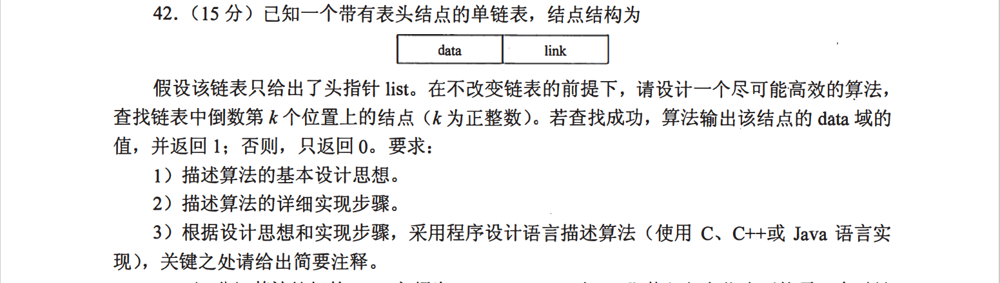
 
 
 
 
 
 
 
 
 
 
 
 
 
 
 
## 2010

 
 
 
 
 
 
 
 
 
 
 
 
 
 
 
 
 
 
## 2011
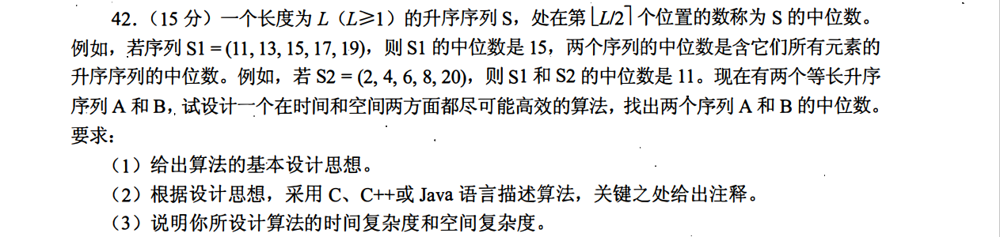
 
 
 
 
 
 
 
 
 
 
 
 
 
 
 
 
 
## 2012

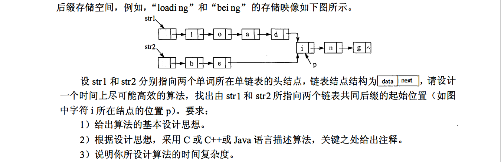
 
 
 
 
 
 
 
 
 
 
 
 
 
 
 
 
## 2013
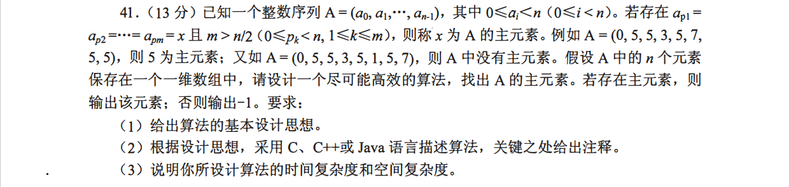
 
 
 
 
 
 
 
 
 
 
 
 
 
 
 
 
 
## 2014
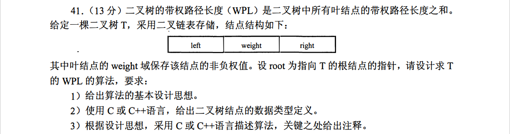
 
 
 
 
 
 
 
 
 
 
 
 
 
 
 
 
 
## 2015
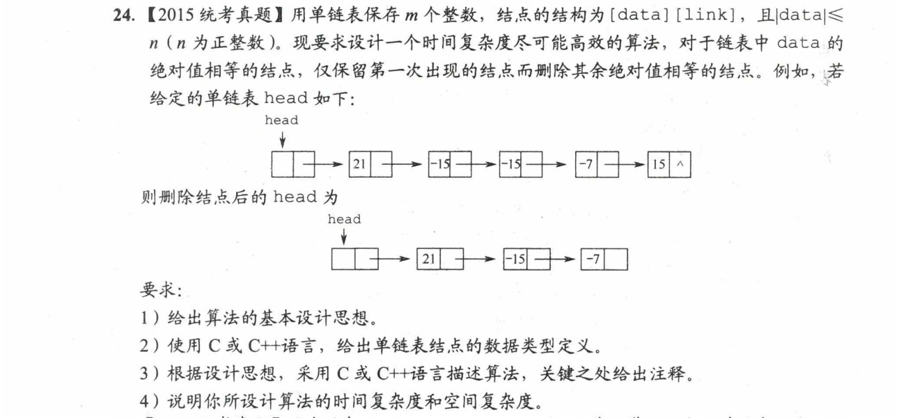
 
 
 
 
 
 
 
 
 
 
 
 
 
 
## 2016
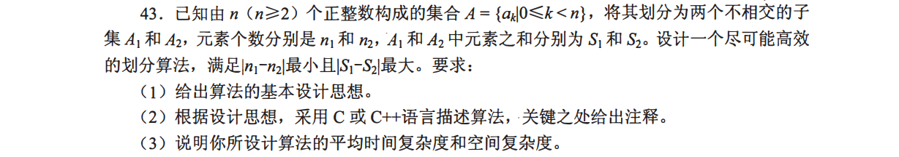
 
 
 
 
 
 
 
 
 
 
 
 
 
 
 
 
 
 
## 2017
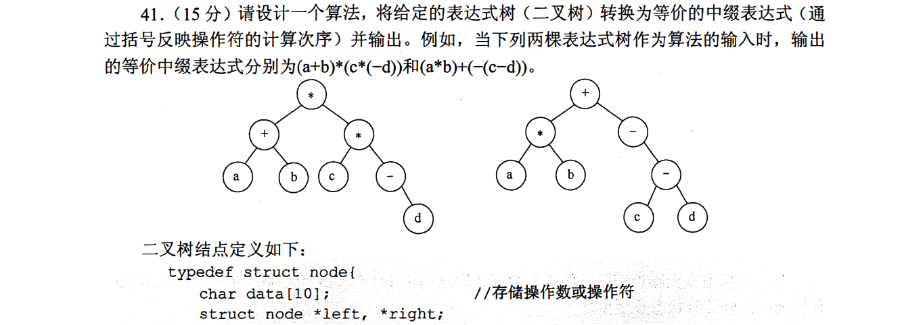

 
 
 
 
 
 
 
 
 
 
 
 
 
 
## 2018
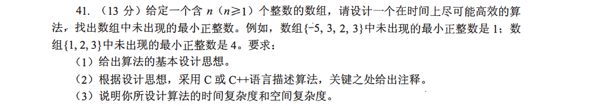
 
 
 
 
 
 
 
 
 
 
 
 
 
 
 
 
 
 
## 2019
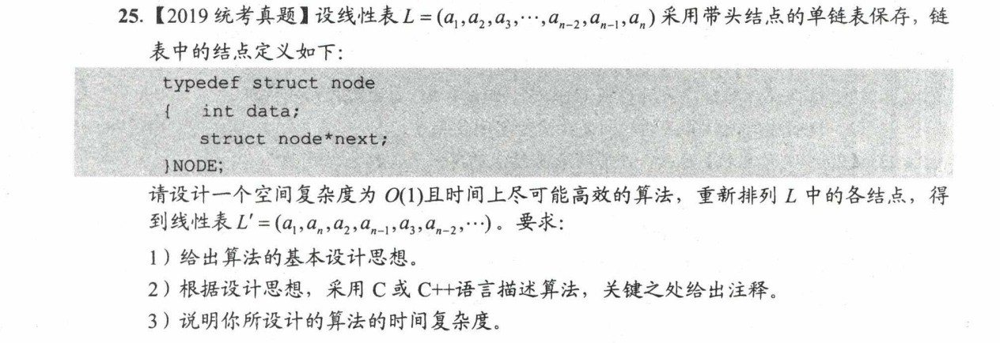
 
 
 
 
 
 
 
 
 
 
 
 
 
 
 
 
## 2020
 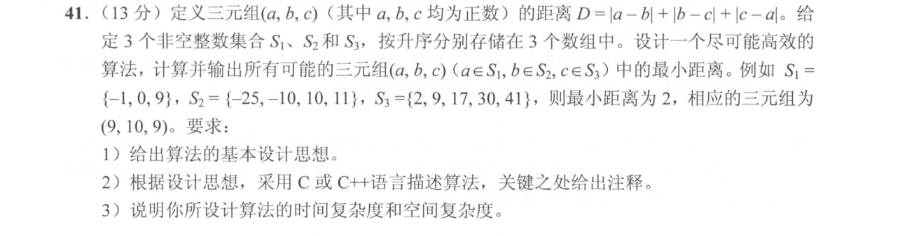
  
 
 
 
 
 
 
 
 
 
 
 
 
 
 
 
 
## 2021
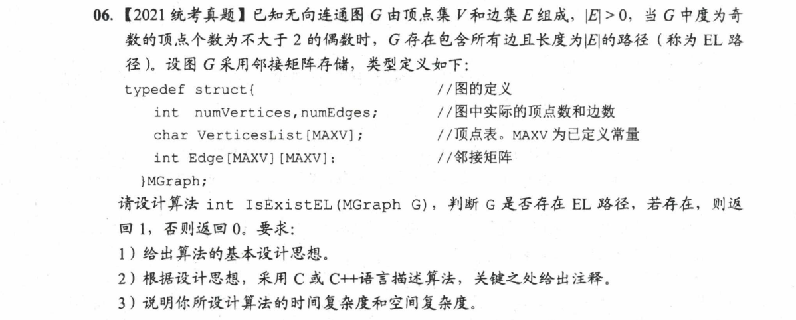
 
 
 
 
 
 
 
 
 
 
 
 
 
 
 
## 2022
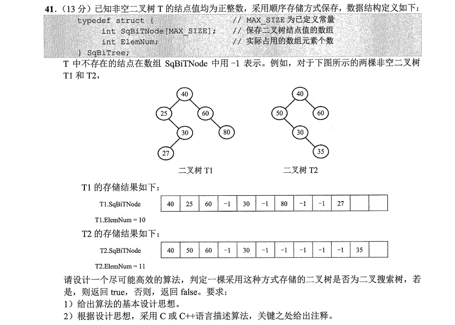